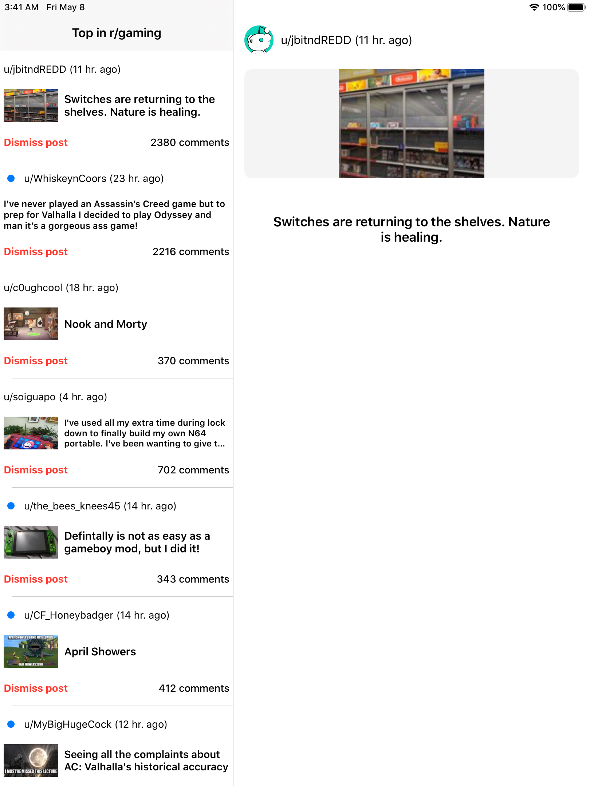
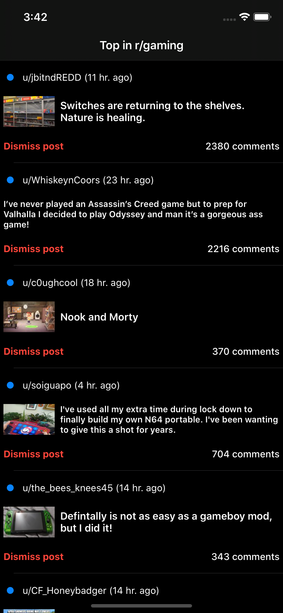
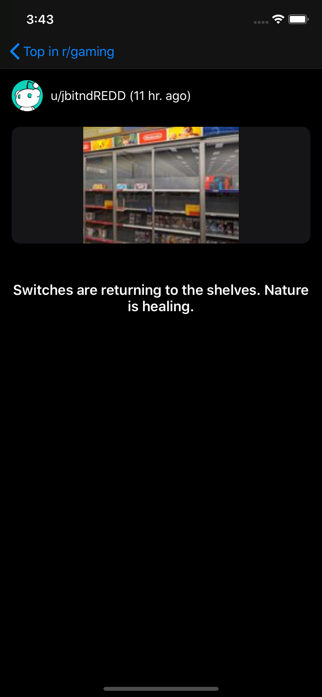

# Reddit Challenge
The challenge was to develop a mini Reddit client without using any third party dependencies.

This project uses an MVC approach and uses traditional methods to request external information to display, without using any external libraries.

## Missing features
Things I couldn't finish in time:

- Infinite scroll to load more posts
- 'Dismiss all' button in main TableView

## Screenshots
### iPad

### iPhone

